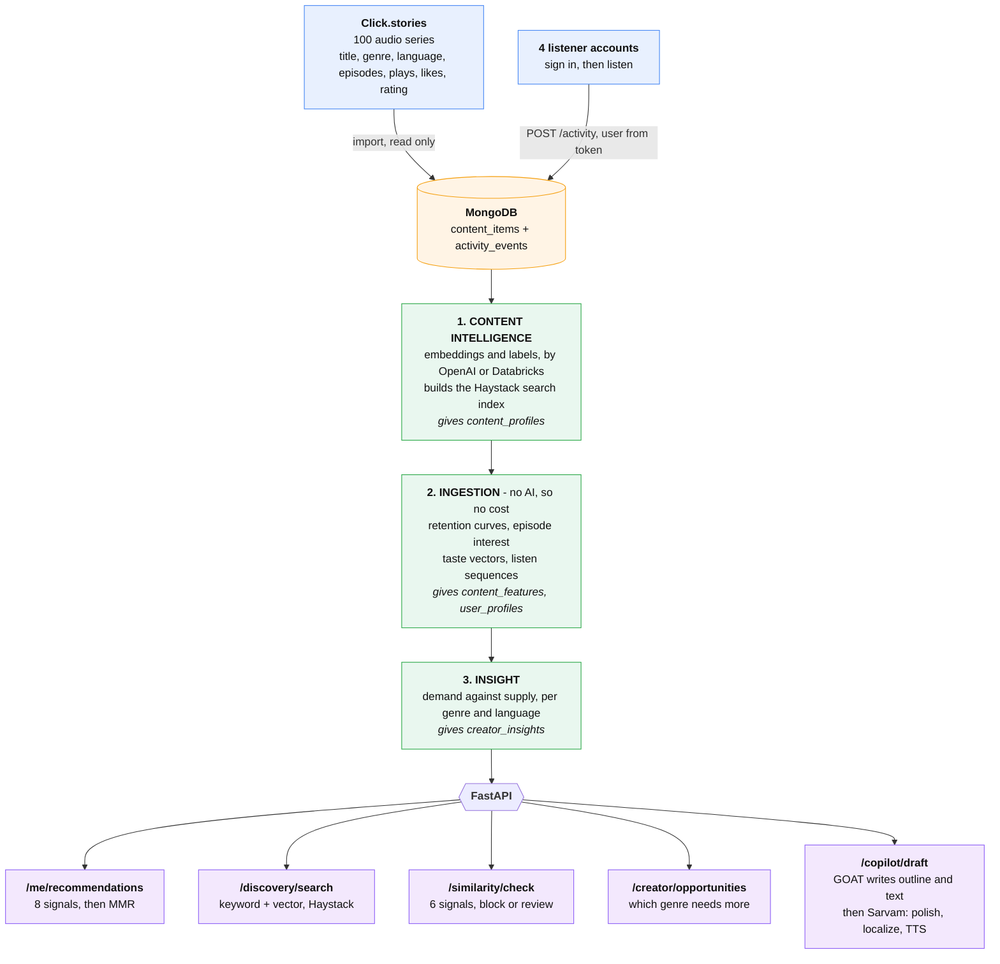
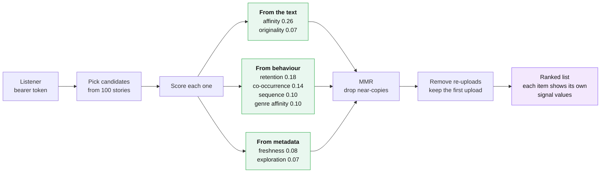
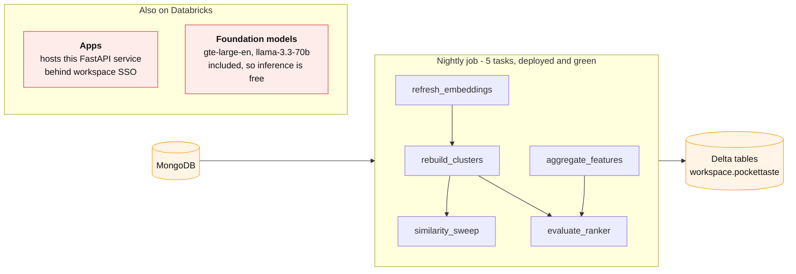

# PocketTaste

An AI layer for long-form audio stories. Backend only. FastAPI.

It does four jobs:

1. It recommends stories to listeners.
2. It tells creators which genre needs more content.
3. It stops duplicate and copied uploads.
4. It helps creators write new stories.

It is an independent layer. It works next to a platform recommender, not instead of
one.

---

## 1. The main flow



The three agents run in that order because each one needs the one before it. Taste
vectors are built from content embeddings. Demand is built from behaviour features.

Trigger it with `POST /pipeline/run`. A background loop also runs steps 2 and 3
every 15 minutes. That loop uses no AI, and it skips when no new event arrived, so it
costs nothing.

---

## 2. How one recommendation is built



Behaviour gives 0.52 of the score. Text gives 0.33. Text is what covers a new story
that nobody has played yet.

**The sequence signal** asks what comes next, not who liked both. The exact pair "A
then B" is rare, so it falls back in three steps and stops at the first answer:

| step | what it uses | value |
|---|---|---|
| 1 | we saw "A then B" | full |
| 2 | we saw "A then X", and B is like X | 80% |
| 3 | we saw "crime in Hindi, then suspense in Hindi" | 50% |

Step 3 is what makes it work with few listeners. A real match always beats a guess.

---

## 3. Databricks



The nightly job runs the slow work: embedding refresh, full-catalog clustering, and
the all-pairs duplicate sweep. It is **not** in the request path. The API works when
Databricks is down.

The jobs import the same code as the API. Two copies of the same maths would drift.

**Live now:**

| | |
|---|---|
| Job | `pockettaste-nightly-intelligence`, all 5 tasks pass in 160s |
| App | <https://pockettaste-api-7474647028679809.aws.databricksapps.com> |
| Delta | `content_profiles`, `content_clusters`, `content_features`, `evaluation_runs` |

Open the app URL in a browser. A token will not work, because Apps sits behind
workspace SSO.

Set `EMBEDDING_PROVIDER=databricks` and `LLM_PROVIDER=databricks` to move inference
off OpenAI. Both are verified working and cost nothing extra.

---

## 4. The similarity gate

The gate stops one story going up many times under new names.

It uses six signals. The strongest is the **story skeleton**: we ask a model for the
premise, the conflict, and the ending, remove all the names, then embed that. A copy
that changes every word keeps the same skeleton.

Measured on a heavy rewrite:

```
word overlap    0.099   <- a normal copy check finds nothing
story skeleton  0.924   <- this finds it
```

It blocks an exact copy. It blocks a title match after it removes "Season 3" or "The
End". Everything else goes to a person.

---

## 5. What we use

| Tool | Where | Why |
|---|---|---|
| FastAPI + MongoDB | Online | It answers a request in milliseconds. |
| Haystack | Search | Keyword and vector search together, joined by rank. |
| OpenAI **or** Databricks | Labels, text | Writes labels and briefs. It never picks a number. |
| GOAT | Copilot | The real package writes the outline and the scenes. |
| Databricks | Nightly, hosting | Slow jobs, Delta tables, and it hosts the API. |
| Sarvam AI | Optional | Indic-language routing, plus a finishing stage after `/copilot/draft`: same-language polish, translation into an Indic language, TTS narration. Off unless `SARVAM_API_KEY` is set. |

---

## 6. Data

| What | Count | Real? |
|---|---|---|
| Stories | 100 | Real. From `Click.stories`. We only read it. |
| Accounts | 4 | Real. |
| Events | 42 | Real. The four users made these. |
| Events | ~19,200 | Simulated. Marked `is_synthetic=true`. |

We never send audio or video. We read the story text and the event rows only.

Every report carries a `provenance` field. It says `mixed` now, and it tells you what
kind of data made the numbers. `scripts/clean_data.py --apply` strips the simulated
rows back out.

---

## 7. Every ask, and where it is built

| The brief asked for | What we built | Where |
|---|---|---|
| Backend only, FastAPI | 52 endpoints, layered, 139 tests | `app/api` |
| Haystack + OpenAI for discovery | Keyword and vector search, joined by rank | `services/discovery.py` |
| MongoDB for normal storage | 9 collections, async driver | `data/` |
| Databricks to automate the pipeline | Nightly job, live and green | `databricks/jobs` |
| "How they interact, when they left, which part they took again" | Retention curve, drop-off point, per-episode replay and interest | `services/feature_builder.py` |
| Logs saved and sent to the AI | Event log to Mongo, then to the 3 agents | `agents/` |
| A few agents, low or no budget | 3 agents. Free loop every 15 min. Free Databricks inference | `agents/`, `services/scheduler.py` |
| "This genre has demand, users do not have this content" | Demand against supply per genre and language | `/creator/opportunities` |
| Real metrics: how many users want what | Listener counts, plays, completion, failed searches, on every row | `/insights/demand` |
| Similarity score to stop the "Season 3" re-upload | 6 signals, story-skeleton match | `services/similarity.py` |
| GOAT for storytelling | The real package, outline and scene text | `services/goat_agent.py` |
| Sarvam AI scope | Wired as an Indic-language provider, and as a finishing stage after GOAT + the similarity gate: polish, Indic translation, TTS narration. Off by default | `services/llm.py`, `services/sarvam_finishing.py` |
| "No fake or fabricated things" | Provenance and confidence on every number | `domain/provenance.py` |

Two things we added because the data asked for them:

- **Sign-in.** Events are tied to an account, so listening is attributable and one
  caller cannot write into another person's history.
- **Duplicate suppression in the ranker.** Finding a re-upload is pointless if the
  recommender still promotes it over the original.

---

## 8. Real data and simulated data

The brief said the engineer must not fabricate anything. That is enforced in code,
not by good intent.

Every number carries a `provenance` tag and a `confidence` label:

| Tag | Meaning |
|---|---|
| `real` | Real catalog, real logged events |
| `simulated_from_real_catalog` | Real catalog and real plays, likes and ratings. The per-listener stream is rebuilt from them |
| `synthetic_simulation` | Both invented, for testing |
| `mixed` | A blend. Filter before you use it |

The catalog stores totals, not a per-listener log. So the listener stream is rebuilt
from each story's real plays, likes and rating. Relative demand between the 100
titles is therefore grounded in real numbers.

The LLM never picks a number. It writes prose from figures the pipeline computed. A
row with too small a sample says `confidence: low` instead of sounding confident.
`scripts/clean_data.py --apply` strips every simulated row back out.

**On positioning.** This is a layer, not a ranker replacement. A production
recommender trained on years of data will out-rank us. It will not tell a creator
which genre is starving, catch a re-titled re-upload, or draft the next series. Those
are the jobs here.

---

## Run it

See **[server/RUNNING.md](server/RUNNING.md)**.
For the full design, see **[server/README.md](server/README.md)**.
