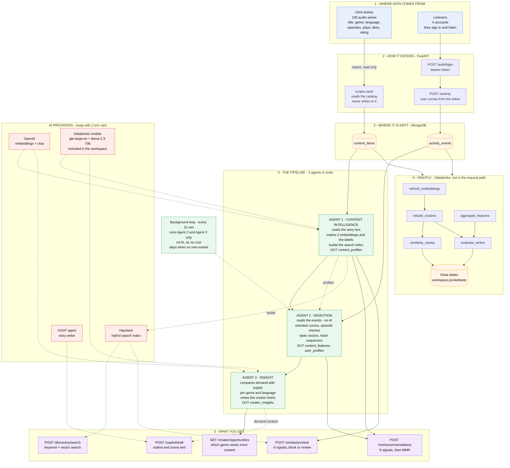
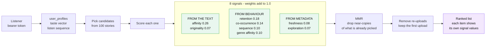

# PocketTaste

An AI layer for long-form audio stories. Backend only. FastAPI.

It does four jobs:

1. It recommends stories to listeners.
2. It tells creators which genre needs more content.
3. It stops duplicate and copied uploads.
4. It helps creators write new stories.

The layer is independent. It does not replace the platform recommender. It works
next to one.

---

## The flow



Start at `GET /` for the list of all endpoints.

### How one recommendation is built



---

## What we use, and why

| Tool | Where | Why |
|---|---|---|
| **FastAPI + MongoDB** | Online | It answers a request in milliseconds. |
| **Haystack** | Search | It runs keyword search and vector search together. It joins the two lists by rank. |
| **OpenAI** | Labels, text | It labels the stories and writes the briefs. It never picks a number. |
| **GOAT** | Copilot | The real package writes the outline and the scenes. |
| **Databricks** | Nightly | It runs the slow jobs. The API never calls it. |
| **Sarvam AI** | Optional | It can write Hindi text. It is off now. |

---

## How the recommender scores a story

Eight signals. Each signal has a published weight. The weights add up to 1.0.

| Signal | Source | Weight |
|---|---|---|
| affinity | story text | 0.26 |
| retention | listener behaviour | 0.18 |
| co-occurrence | listener behaviour | 0.14 |
| **sequence** | listener behaviour | 0.10 |
| genre affinity | listener behaviour | 0.10 |
| freshness | publish date | 0.08 |
| originality | duplicate check | 0.07 |
| exploration | play count | 0.07 |

Behaviour gives 0.52. Text gives 0.33. Text covers a new story that nobody played.

**The sequence signal** asks a different question. Co-occurrence asks "who liked
both?". Sequence asks "what comes next?". For a serial story, the order matters.

The exact pair "A then B" is rare. So the signal uses three steps. It stops at the
first step that gives an answer:

1. We saw "A then B". Use it. Full value.
2. We saw "A then X", and B is like X. Use it. 80 percent value.
3. We saw "crime in Hindi, then suspense in Hindi". Use it. 50 percent value.

Step 3 makes the signal work with few listeners. A real match always beats a guess.

---

## The similarity gate

The gate stops the problem in the brief. One story goes up many times with new
names.

It uses six signals. The strongest one is the **story skeleton**. We ask OpenAI for
the premise, the conflict, and the ending. We remove all the names. Then we embed
that text.

A copy that changes every word keeps the same skeleton.

Our test on a heavy rewrite:

```
  word overlap    0.099   <- a normal copy check finds nothing
  story skeleton  0.924   <- this finds it
```

The gate blocks an exact copy. It also blocks a title match after it removes
"Season 3" or "The End". Other cases go to a person.

---

## The background loop

The pipeline runs every 15 minutes. It costs nothing.

- It runs Agent 2 and Agent 3 only. Both use no AI.
- It skips the run if no new event arrived.
- Agent 1 is not in the loop. Agent 1 costs money. You start it by hand.

---

## Databricks

Databricks is the nightly tier. It is not in the request path. The API works when
Databricks is down.

Five jobs run in this order:

```
  refresh_embeddings --> rebuild_clusters --> similarity_sweep
  aggregate_features -----------------------> evaluate_ranker
```

The jobs import the same code as the API. Two copies of the same maths would drift.

**Status: deployed. All five jobs pass in 160 seconds.** They write four Delta
tables.

---

## Data

| What | Count | Real? |
|---|---|---|
| Stories | 100 | Real. From `Click.stories`. We only read it. |
| Accounts | 4 | Real. |
| Events | 42 | Real. The four users made these. |
| Events | 663 | Simulated. Marked `is_synthetic=true`. |

We never send audio or video. We read the story text and the event rows only.

Every report has a `provenance` field. It says `mixed` now. It tells you what kind
of data made the numbers.

---

## What is done

- [x] Import the real catalog
- [x] Sign-in with email and password
- [x] Event log tied to the account
- [x] Three agents and the pipeline
- [x] Recommender with 8 signals and MMR
- [x] Sequence signal with three-step backoff
- [x] Similarity gate with 6 signals
- [x] Demand report for creators
- [x] GOAT copilot: outline and scenes
- [x] Background loop with no AI cost
- [x] Databricks jobs, deployed
- [x] 139 tests

---

## Limits

Read this before you present.

1. **Four listeners is too few.** Every demand row says `confidence: low`. The
   system reports this itself. It does not hide it.
2. **No transcripts.** The catalog holds a summary, not a script. So we understand
   the metadata. We do not understand the audio.
3. **Episode times are estimates.** We divide the total time by the episode count.
4. **This is not better than NVIDIA Merlin.** Merlin ranks better. Our layer does
   jobs that Merlin does not do.

---

## Run it

See **[server/RUNNING.md](server/RUNNING.md)**.

For the full design, see **[server/README.md](server/README.md)**.
